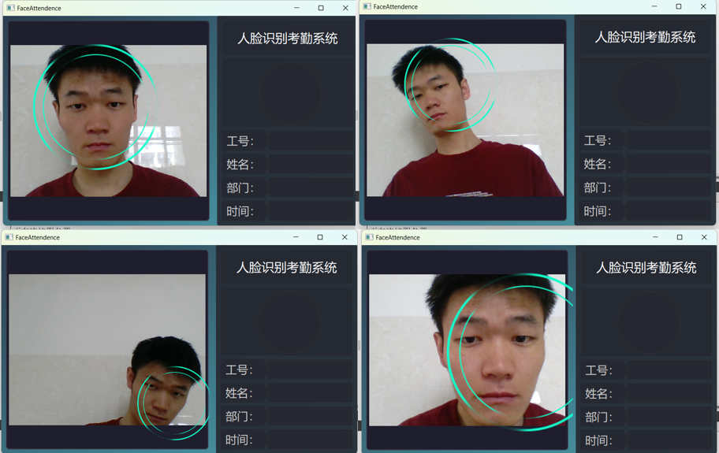
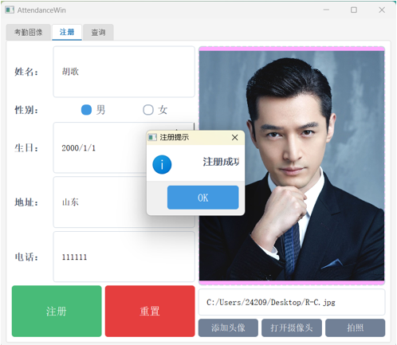
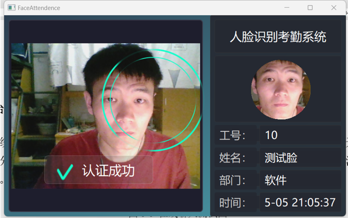
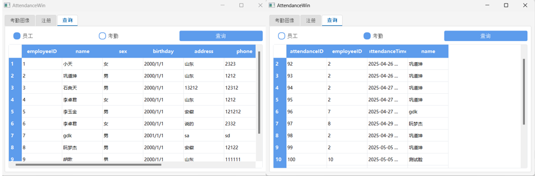

# 人脸识别系统 - Face Register

## 📌 项目概述

基于Qt和OpenCV开发的跨平台人脸识别系统，支持人脸注册、识别和管理功能。

## ✨ 核心功能

- 实时人脸检测与识别
- 人脸数据注册与管理
- 多用户支持
- 识别记录存储
- 可配置识别阈值
### 人脸检测

### 后端登录

### 人脸注册演示

### 识别成功

### 数据管理

## 🛠️ 技术栈

| 技术        | 用途                |
|-------------|-------------------|
| Qt 5.15+    | GUI界面开发         |
| OpenCV 4.5+ | 图像处理与人脸识别   |
| SeetaFace | 人脸识别引擎   |
| SQLite3     | 本地数据存储        |
| qmake       | 项目构建            |

